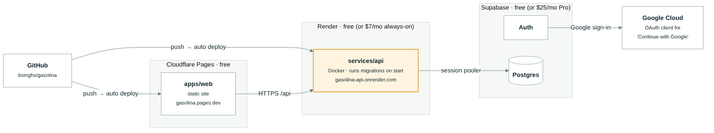
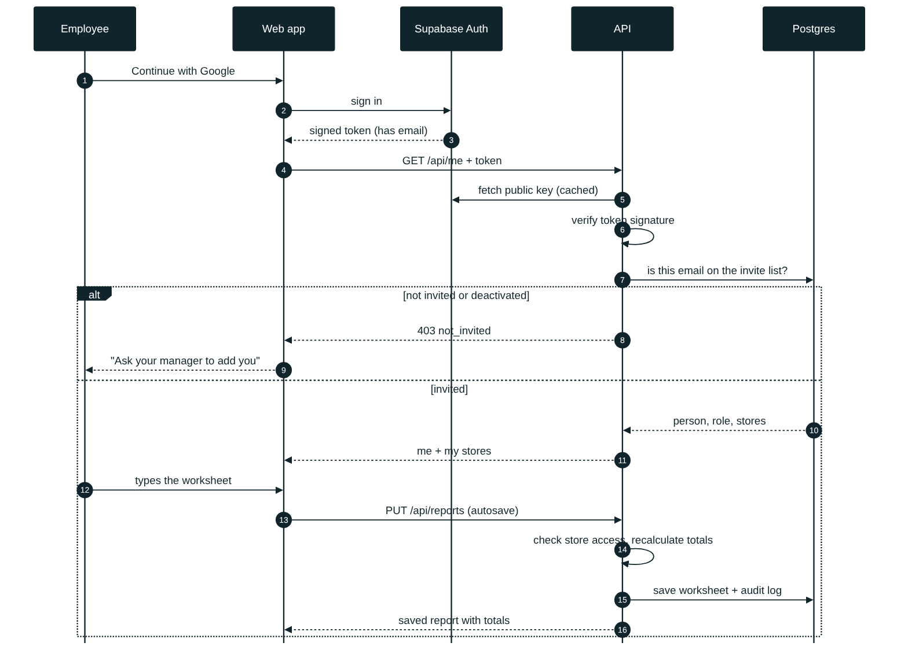
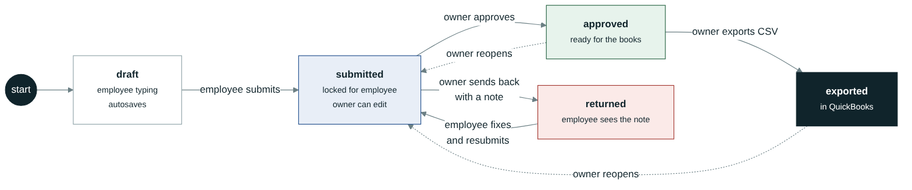
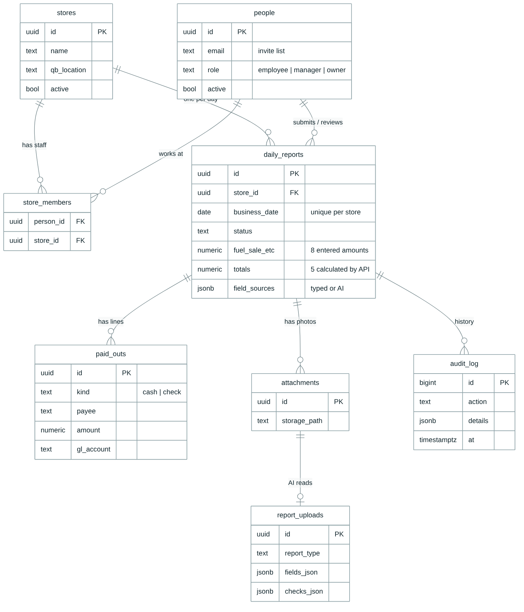

# Architecture

## The big picture


**Rules that keep it simple**

1. **The browser only talks to the API.** It never reads or writes the database directly. Supabase is used for sign-in only; the API checks the sign-in token on every request.
2. **All business rules live in the API**: who can see which store, the status workflow, and the worksheet math. The web app shows a live preview of the totals, but the API recalculates on every save and its numbers are the ones stored.
3. **One folder per feature** in the API, and every feature folder looks the same (below).

## Where it runs



Every push to `main` on GitHub redeploys both the web app and the API. The API applies any new database migrations when it starts. Step-by-step setup is in [DEPLOY.md](DEPLOY.md).

## What happens when someone signs in and saves



Nobody gets in unless their email is on the **People** list. The API checks store access on every call, so an employee can't read or write another store's worksheets even by editing requests by hand.

## Worksheet status workflow



Every step is written to `audit_log` with who did it and when, and shows as History on the owner's day screen.

| Role | Can do |
| --- | --- |
| employee | Fill and submit worksheets for their assigned stores; edit while draft or sent back |
| manager | Same as employee, for all their stores (room to grow into first-pass review) |
| owner | Everything: review, approve, send back, reopen, export, people, stores, settings, books, inventory |
| coowner | Sees every owner page, changes nothing: no change buttons on the screens, and the API refuses changes |

Permissions are one table (`app/core/permissions.py`, mirrored in `apps/web/src/lib/access.ts`): owner/admin have `see_all_stores`, `make_changes`, `manage_owners`; coowner only `see_all_stores`; manager/employee `make_changes` on their own stores. The API's `current_user` gate refuses any non-read request without `make_changes`; screens use `useViewOnly()` to hide change buttons.

## Data model



The full schema, with every column, is in [`database/migrations/001_initial_schema.sql`](../database/migrations/001_initial_schema.sql). Money is always `numeric(12,2)`. `report_uploads` and `attachments` already exist for the AI report-scanning step.

## Code layout

```
services/api/app/
├── main.py            starts the app, plugs in each module's router
├── core/              shared plumbing used by every module
│   ├── config.py      settings from environment variables
│   ├── db.py          database connection + fetch_one / fetch_all / execute
│   ├── auth.py        sign-in token -> CurrentUser; the one gate (view-only roles can't save); owner_only
│   ├── permissions.py who may do what: one table per role (same table in web lib/access.ts)
│   ├── errors.py      not_found(), forbidden(), ...
│   ├── dates.py       business_today(): "today" in the stores' time zone (servers run in UTC)
│   ├── audit.py       one history-log line for owner actions (books, vendors)
│   └── json.py        exact(): money out as strings, never floats
└── modules/
    ├── me/            who am I, which stores can I use
    ├── stores/        gas station locations
    ├── people/        invite list and roles
    ├── reports/       the daily worksheet and its approval workflow
    │   ├── router.py          HTTP endpoints (thin)
    │   ├── schemas.py         request/response shapes
    │   ├── service.py         the rules: save, submit, return, approve, reopen
    │   └── reconciliation.py  the worksheet math (pure, tested)
    ├── exports/       QuickBooks journal-entry CSV and other downloads
    │   └── journal_entry.py   worksheet -> balanced journal entry (pure, tested)
    ├── settings/      QuickBooks account names, over/short alert, sales tax rate
    ├── summaries/     sales totals for a month / quarter / year (read-only)
    ├── vendors/       vendor list (cost of goods or expense) + spending by vendor
    ├── books/         owner's typed purchases / expenses (incl. fuel deliveries), Profit & Loss, Balance Sheet
    │   └── math.py            P&L and balance-sheet math (pure, tested)
    ├── inventory/     fuel tanks + merchandise per store (read-only; owner home page)
    │   └── math.py            on hand, % full, used, days left, pump check, bought vs sold (pure, tested)
    └── admin/         test-only reset; View-as lives in core/auth.py
```

`router.py` = endpoints, `schemas.py` = data shapes, `service.py` = rules. Small modules keep their few SQL queries in the router; when a module grows rules, they move to `service.py`.

```
apps/web/src/
├── api/        client.ts (every API call in one place) + types.ts
├── auth/       AuthProvider: sign-in state, attaches the token to API calls
├── components/ small shared pieces (status chip, over/short gauge, paid-out lines)
├── lib/        money, dates, live reconciliation preview
└── pages/      one file per screen
```

Interactive API documentation (every endpoint, try it in the browser) is at `http://localhost:8000/docs` when the API is running.

## Growing into separate services

Modules are separated by feature and only meet through the database, so any of them can become its own service later without rewriting it. The planned next ones (dashed in the diagram):

- **services/ai**: reads a photo of the register report and returns the worksheet fields (fills `report_uploads`).
- **services/quickbooks**: posts approved days straight into QuickBooks Online through Intuit's API (fills `qb_txn_id`).

Each will be a small FastAPI app next to `services/api`, with its own Dockerfile, called by the API.

## Adding a feature

1. If it needs a table or column, add `database/migrations/00N_what.sql`.
2. Add `services/api/app/modules/<feature>/router.py` (+ `schemas.py`, + `service.py` if it has rules).
3. Plug the router into `app/main.py`.
4. Add the calls to `apps/web/src/api/client.ts` and a page in `apps/web/src/pages/`.
5. Add a test in `services/api/tests/`.

## Editing the diagrams

The pictures are generated from the text files in [`diagrams/`](diagrams/) (`*.mmd`, Mermaid syntax). Change the text, then re-render:

```bash
cd docs/diagrams
npx -p @mermaid-js/mermaid-cli mmdc -c theme.json -b white -s 2 -i 1-architecture.mmd -o 1-architecture.png
```

GitHub and VS Code (with the "Markdown Preview Mermaid Support" extension) can also show Mermaid text directly.
